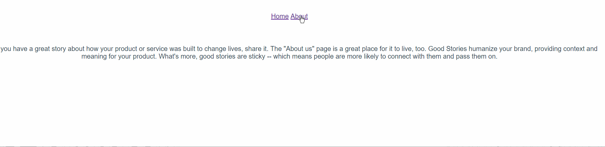

## vue2-spa

Create a very simple SPA with Vue 2 and Vue Router with [How To Build a Simple Single Page Application Using Vue 2 - Part 1](https://scotch.io/tutorials/how-to-build-a-simple-single-page-application-using-vue-2-part-1)



### Build Setup

``` bash
# install dependencies
npm install

# serve with hot reload at localhost:8080
npm run dev

# build for production with minification
npm run build

# build for production and view the bundle analyzer report
npm run build --report
```
